# 第0讲 欢迎来到C\#

## 引言

大家好，我是ReFreSH俱乐部的尹照宇，从今天开始，我来为大家开启我们的后端培训课程。现在坐在寝室、自习室或者图书馆的各位同学想必或多或少都对后端开发有些了解。

后端开发是一个从互联网诞生开始就存在的领域，后端是网站运行在服务器上的程序。最早的后端框架是CGI，主要的开发语言是C、C++，这两种语言的开发效率实在是低，因此市场上相继出现了PHP、Java、C#(/si: ʃɑːrp/，音同See Sharp)等一系列极大提升开发效率的编程语言。

经过多年的发展，目前后端开发越来越向云计算、微服务靠拢。同时又涌现了诸如Go、Node等优秀的语言(框架)，PHP也逐渐退出了历史的舞台。

因此，经过综合的考虑，为了让大家在云计算和微服务的时代潮流下更好地了解后端开发的知识，我们特地选择了上手快、易掌握、云原生的后端框架ASP .Net Core与后端语言C#作为大家后端开发的第一站。只要精通了我们教给大家的框架，了解后端开发的基本原理，那么世界上所有其他的后端框架与语言都能触类旁通，融汇贯通，工作后进行后端开发也会如鱼得水，如虎添翼。

我们的第一节课将会是C\#语言基础，目前C\#也是原生桌面开发的首选语言，因此本课程也面向想学习桌面开发的同学。我们之后也会进行基于C\#的桌面开发培训。

我们的第零节课，没有任何人来教，所有的事情都需要你自己做，需要你来安装我们上课时需要使用的软件。为了保证课程的连贯性，请务必在课前安装我们列出的软件！

| 系统    | 一定要安装的                              | 可选安装的 |
| ------- | ----------------------------------------- | ---------- |
| Windows | Visual Studio                             | ReSharper  |
| Linux   | Visual Studio Code或Rider二选一，.Net CLI |            |
| macOS   | Visual Studio Code或Rider二选一，.Net CLI |            |

本表为一览表，具体安装细节详见后文。

注意：虽然C\#，.Net是跨平台框架，能够运行在Windows、macOS和Linux上，但是我们在课程中主要会使用Visual Studio，对于其他工具，我们在课程中无法过多提及，可能会在如创建工程方面有所不一样。

## Visual Studio（Windows使用）

Visual Studio是目前世界上最先进的IDE，也是目前开发C\#的首选开发工具，除此之外也支持C/C++、JavaScript、TypeScript、Python、F\#等语言的开发。

对于学生来说，Visual Studio的社区版是免费的，也满足我们的学习需求，下面就来安装Visual Studio 2019的社区版。

首先，登录Visual Studio的官网[Visual Studio: 面向软件开发人员和 Teams 的 IDE 和代码编辑器 (microsoft.com)](https://visualstudio.microsoft.com/zh-hans/)，选择下载Visual Studio Community 2019进行下载。

注：虽然我们这里说选择免费的Community下载，不过你仍然可以选择Professional或者Enterprise版的然后在网上搜索序列号使用。专业版和企业版的功能虽然更多，但是毕竟是盗版，不提倡使用。若想合法使用这两个版本，可以下载[预览版的Visual Studio](https://visualstudio.microsoft.com/zh-hans/vs/preview/)，预览版的Visual Studio是免费的，但是不能用于生产，而我们是学习用途，可以使用。此外，ReSharper插件（详见下文）目前还不支持预览版的Visual Studio。

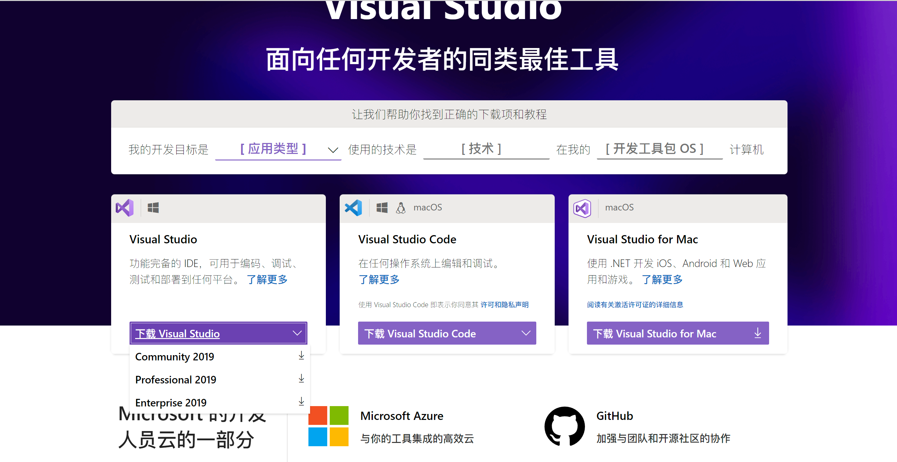

当然，如果你使用的是macOS，你需要选择右侧的Visual Studio for Mac下载。

在下载完安装器后，我们打开下载的文件，选择最上面的“ASP .Net和Web开发”和最下面的“.Net跨平台开发”，然后点击安装。

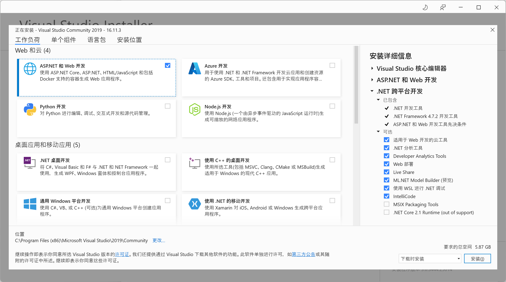

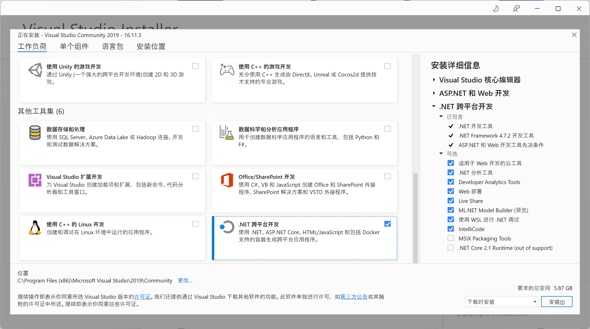

当然，如果你也对桌面开发感兴趣，也可以在这里选择“.Net 桌面开发”。

在安装完成后，可能会让你重启计算机，重启即可。默认来说，Visual Studio安装后不会再桌面创建快捷键方式，只会在开始菜单创建快捷键方式，你可以通过开始菜单打开Visual Studio，也可以手动为其创建桌面快捷键方式。

第一次运行Visual Studio会让你进行一些设置，这些设置不会影响功能，根据个人喜好选择就可以了。

## Visual Studio的字体设置（强烈推荐）

目前Visual Studio的中文版默认字体是**宋体**，这种字体既不美观也不实用。在编程时强烈推荐使用**等宽字体**，等宽字体，顾名思义，所有的数字、字母、英文符号、空格的宽度是相等的，而中文字符的宽度是其的两倍。

在编程时使用这种字体最显著的好处是能够看清代码的层级，比如在下面的例子中，显然等宽字体（下）要比非等宽字体（上）看起来更加舒适，能够一下子看出来代码的结构。这样的效果，在面对大量代码时更加显著。

因此，在这里推荐一款支持中文的等宽字体，[更纱黑体](https://mirrors.tuna.tsinghua.edu.cn/github-release/be5invis/Sarasa-Gothic/Sarasa%20Gothic%20version%200.34.3/sarasa-gothic-ttc-0.34.3.7z)，下载完成后解压，选择全部解压出所有的**文件**，右键选择安装即可。

安装完成后打开Visual Studio，选择“继续但无需代码”。

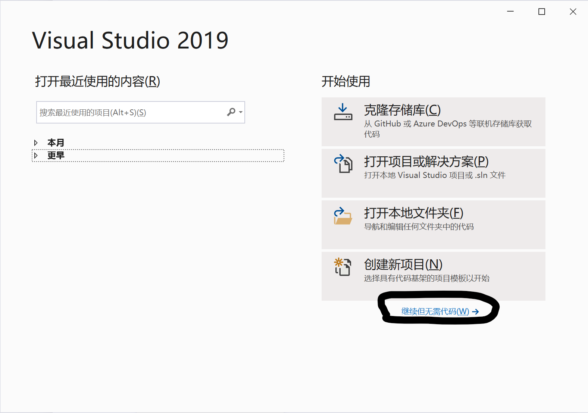

然后选择顶部工具栏的工具-选项。

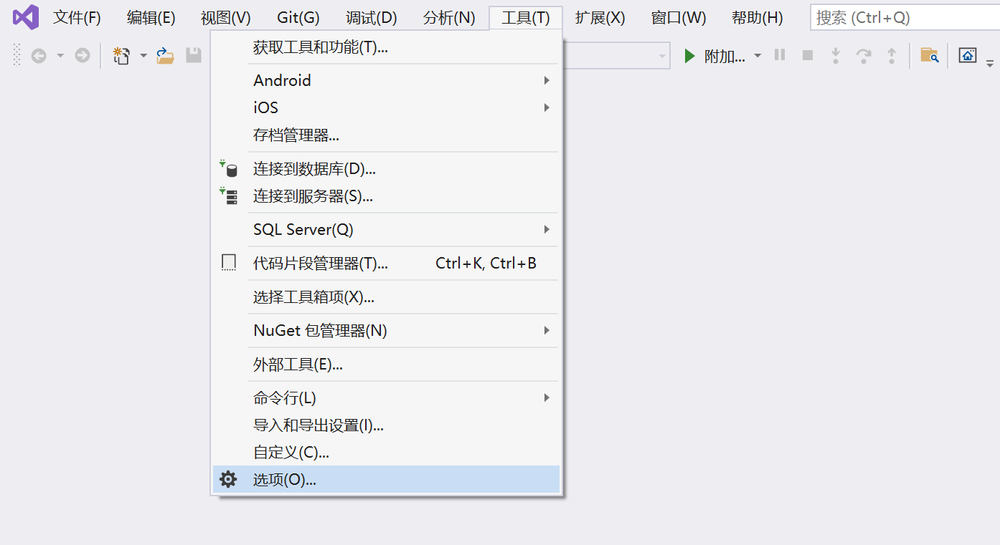

在最上面的环境-字体和颜色中选择“等距更纱黑体 SC”，或者你喜欢的其他等宽字体。如果你不想找，可以在上面的搜索选项中直接搜索字体就有这项。

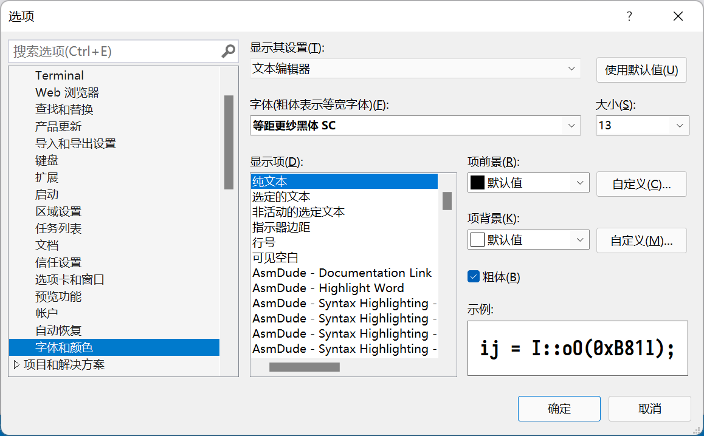

然后点击“确定”保存即可。

## ReSharper（可选，推荐，仅限Windows）

ReSharper是一款JetBrains开发的Visual Studio插件，能够为你的Visual Studio提供更好代码补全功能，并且还有自动反编译、一键重构等好用的功能，能够极大地提升开发效率。

但是美中不足的是这款插件会拖慢Visual Studio的启动速度，并且没有中文支持。也就是说，安装这款插件会使你的Visual Studio加载变慢，并且在插件的功能处会出现英文。

总而言之，这款插件还是很推荐安装的，尤其是对初学者来说，ReSharper能够检测不符合规范或者有潜在问题的代码，并且提供修改建议。

对于学生来说，ReSharper也是免费的，不过需要注册JetBrains的学生账号，下面是申请安装的详细过程。

首先登录JetBrains的教育授权的网页[Free Educational Licenses - Community Support (jetbrains.com)](https://www.jetbrains.com/community/education/#students)，在下面的For Students and Teachers中找到并点击“Apply Now”。

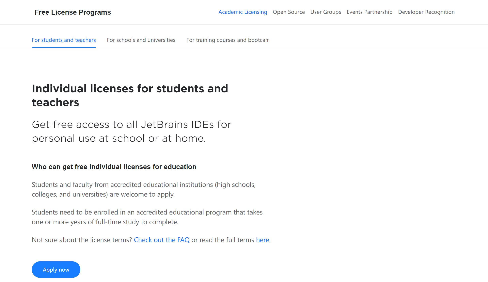

接下来弹出的界面默认有中文，这里就稍微说一下重点。

这里的电子邮件地址要使用学校的电子邮件，一般来说是`学号@stu.hit.edu.cn`，另外学校的电子邮件系统比较慢，如果确认邮件比较慢，很久没收到，请多等待一会儿并且检查垃圾邮件。

如果无法使用学校邮箱注册，可以尝试使用“官方账号”注册。ReSharper并非本课程必须，但是在未来四年里你肯定会需要JetBrains的工具。

在确认电子邮件之后，登录账号，就会进入到License管理界面，这里在“JetBrains Product Pack for Students”下面选择Download，然后选择ReSharper Ultimate右侧的Download就能下载了。

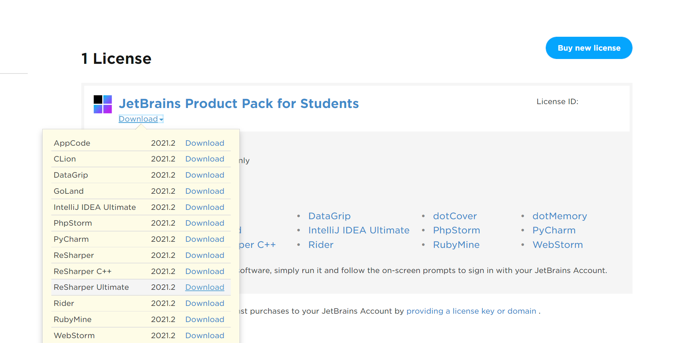

[上图页面的链接](https://account.jetbrains.com/licenses)

下载之后，一直下一步就安装完成了。

在安装完成后，建议打开一次Visual Studio完成ReSharper拓展的激活。打开Visual Studio然后选择“继续但无需代码”。

这里会弹出两个窗口，一个窗口有三个选项，是询问使用的键盘布局，这里按照个人喜好选择就行，一般来说选择第一个。另一个窗口是激活窗口，这里讲解一下。

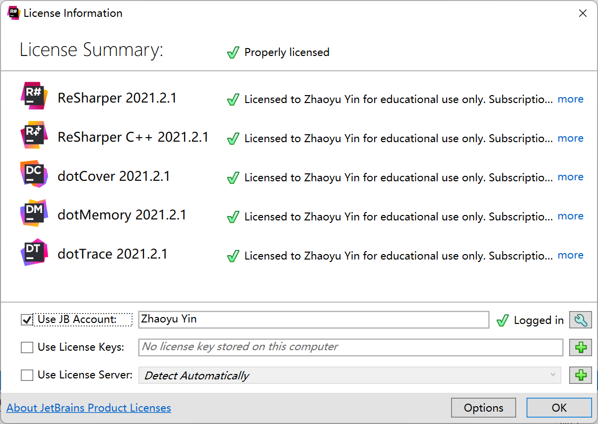

我这里已经激活过了，所以这里都是勾，但是在第一次打开的情况下，这里不会显示勾，在“Use JB Account”这一行右侧会有一个“Login In”的按钮，点击然后输入刚才注册的账号密码就可以了。

ReSharper的基本使用方法就是被动使用，等他提醒你哪里有问题可以按照他的想法一键修改就行，其他高级的使用方法网上有很多资料可以参考。

## Rider（macOS与Linux使用，与Code二选一）

在macOS上，虽然也有叫做“Visual Studio”的软件，但是这个Visual Studio远没有Windows上的好用，也没有ReSharper，而且Linux上根本就没有Visual Studio，这种情况下可以考虑使用Rider。

Rider是JetBrains开发的一款跨平台IDE，自带ReSharper的功能，但是没有中文（目前JetBrains全系IDE都有中文包了，就Rider没有）。

Rider同样包含在JetBrains的教育包里，只要你按照上节的方法申请，在[下载界面](https://account.jetbrains.com/licenses)选择Rider下载即可。首次启动仍需要激活，与ReSharper的激活方式大同小异，同样是需要登录申请的账号。

## Visual Studio Code（macOS与Linux使用，与Rider二选一）

如果你觉得申请JetBrains太麻烦了，或者英文不好，或者喜欢自由软件，可以考虑使用Visual Studio Code。

Visual Studio Code的安装十分简单，只需登录官网[Visual Studio Code - Code Editing. Redefined](https://code.visualstudio.com/)下载即可。

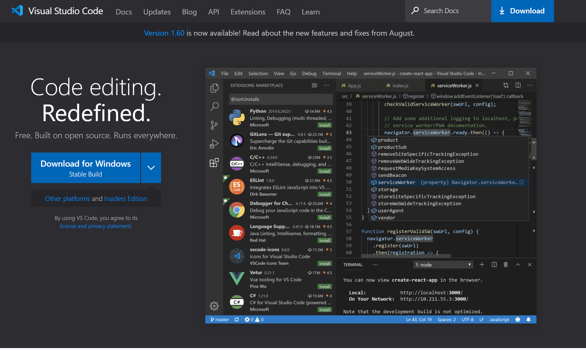

中间最大的蓝色按钮永远是你的平台的下载地址，我这里用Windows截图，所以显示的是Windows的下载，如果你使用的是macOS，这里就是macOS的下载链接。如果你使用Linux，我们默认你熟知使用包管理器安装程序，就更不需要讲述了。

使用Code开发C\#程序需要安装如下的拓展：

C#、 Visual Studio IntelliCode

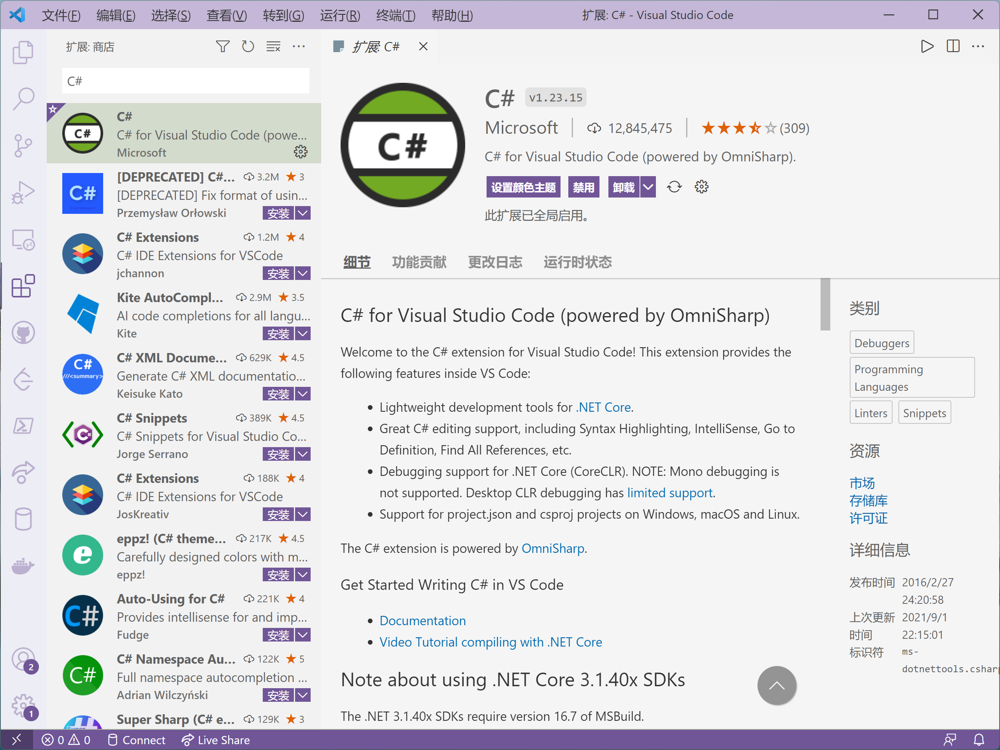

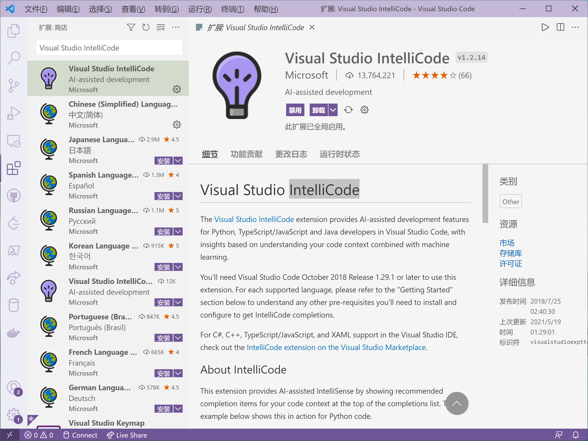

注意：Visual Studio Code没有新建C\#项目的功能，你需要学习如何使用dotnet CLI创建新工程。dotnet CLI比较复杂，但是有详细的官方中文档[.NET CLI | Microsoft Docs](https://docs.microsoft.com/zh-cn/dotnet/core/tools/)，这里就不细说了。

## .Net CLI（如果你使用Rider或者Code，那就必须安装）

首先登录下载界面[Download .NET (Linux, macOS, and Windows) (microsoft.com)](https://dotnet.microsoft.com/download)。

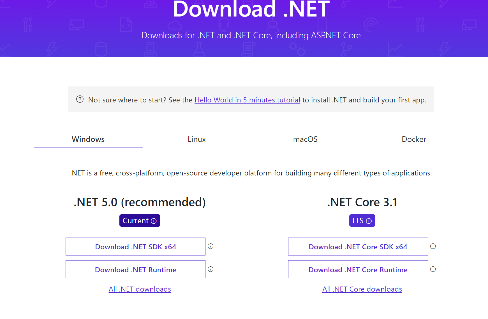

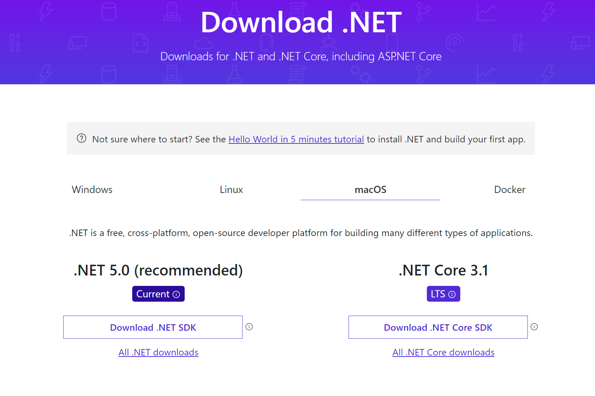

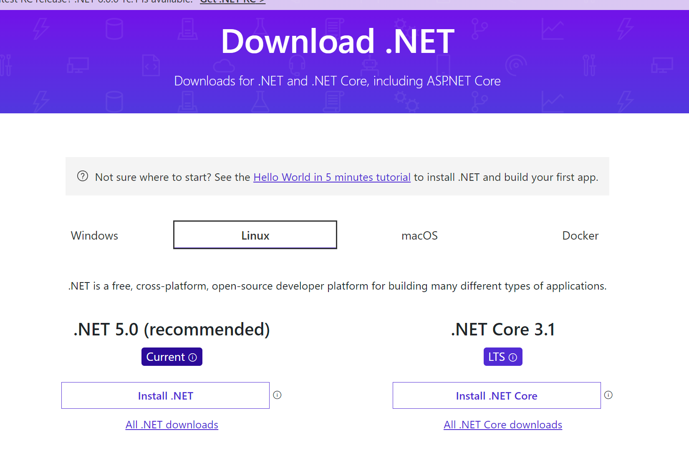

这里永远会为你推荐最适合你的下载，你要做的就是点击左侧第一个按钮就可以了。

如前面所说的，如果你使用Code，那么你就需要学习.Net CLI的用法，而如果使用Rider，仅安装就可以了。
